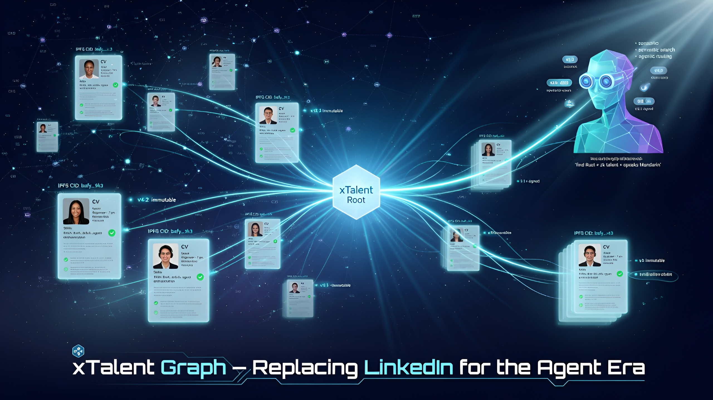
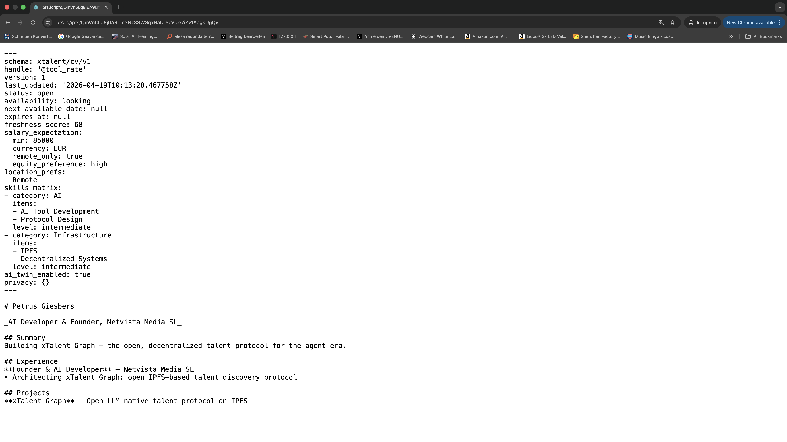
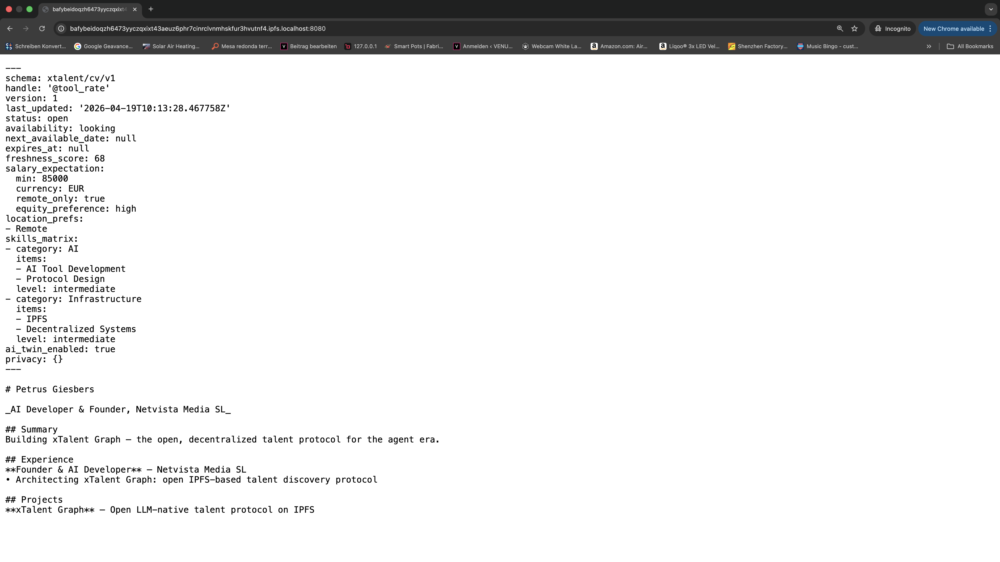

<p align="center">
  
</p>

# xTalent Graph

**The open, LLM-native talent protocol for the agent era.**

Type `/talent-scout` in any AI chat.
It runs a real interview, builds a structured `cv.md`, and publishes it to the Talent Graph.

Any LLM or company can find you instantly — by asking in plain English.

**No job boards. No recruiters. No gatekeepers.**

**Status:** v0.1

---

### Try it in 30 seconds

```bash
cd python
pip install -e ".[dev]"
python -m examples.publish_demo
```

The demo uses `InMemoryIPFS` for zero setup.
When ready, switch to real Kubo IPFS for permanent decentralized storage.

---

## Core features — now live

- ✅ **Immutable CVs pinned on real IPFS (Kubo).** `xtalent.backends.kubo.KuboIPFS` talks directly to a Kubo node's HTTP API. Install `xtalent[kubo]`, set `XTALENT_IPFS_MODE=kubo`, and every published CV gets a real CID, actually pinned.
- ✅ **Cryptographically signed mutable profile roots (Ed25519).** `xtalent.signing` produces and verifies signatures over a canonical JSON form. The `pubkey` is bound into the signed payload, so an attacker can't swap it. `TalentSearchIndex(require_signatures=True)` fail-closes on tampered or unsigned records.
- ✅ **Production-grade Qdrant semantic search.** `xtalent.backends.qdrant.QdrantIndex` drops into the `VectorIndex` protocol — `:memory:` for tests, remote Qdrant Cloud in production. The reference server auto-switches on `XTALENT_QDRANT_URL`.

One command brings all three up:

```bash
pip install "xtalent[qdrant,kubo]"
docker compose -f docker-compose.dev.yml up -d       # Qdrant + Kubo

XTALENT_QDRANT_URL=http://localhost:6333 \
XTALENT_IPFS_MODE=kubo \
XTALENT_KUBO_URL=http://localhost:5001 \
    uvicorn xtalent.api:app --reload
```

## Why this exists

LinkedIn is a walled garden. CVs are PDFs. Recruiters spam. AI agents can't reliably read, reason over, or act on human career data without scraping captchas and fighting rate limits.

**xTalent Graph** is the anti-LinkedIn: an open, content-addressed, LLM-native protocol where every CV is a structured Markdown document pinned on IPFS, every live profile is a signed, verifiable pointer, and the whole graph is searchable by any agent through a public API.

### How it compares

|                             | xTalent Graph | LinkedIn | Resume PDFs |
|-----------------------------|---------------|----------|-------------|
| **Agent access**            | First-class public API | Blocked / scraping | None (opaque binary) |
| **Data ownership**          | The author owns the bytes, pinned on IPFS | LinkedIn owns and gates the data | The author owns a file |
| **Immutable history**       | Every version has a CID, permanent | Revisions overwrite silently | Multiple versions drift |
| **Semantic search**         | Native, model-pluggable | Keyword + paid filters | None |
| **Privacy controls**        | Tombstone + opt-in discovery | Profile fields, closed-source rules | You email the PDF |
| **Spam model**              | No mass outreach primitive | Ad-driven inbox | Cold email |
| **Cost to the author**      | $0 (protocol) | Free tier + paid upsell | $0 |
| **Verifiable provenance**   | CID + Ed25519-signed profile roots (shipping) | Platform trust only | None |

## How the pieces fit

- **Immutable CV history** — every version of your CV is a `cv-vN.md` file (YAML frontmatter + Markdown body), content-addressed on IPFS. History is permanent and verifiable.
- **Mutable profile root** — a small JSON document points at your latest CV and carries live signals (availability, location, freshness). This is the only part that changes — and it's the part that gets signed.
- **Agent-first by design** — a stable JSON-over-HTTP API, stable schemas, stable URIs. No scraping. No login walls. No dark patterns.
- **Privacy and anti-spam primitives** — opt-in contact handles, revocable pointers, GDPR-shaped deletion via profile-root tombstones.

## Quick start

### Path A — full dev stack (Qdrant + real IPFS), one command

This is the recommended way to see the protocol for real. You get signed profile roots, real IPFS pinning, and a Qdrant-backed semantic index — end to end.

```bash
git clone https://github.com/netvistamedia/xtalent-graph
cd xtalent-graph/python
pip install -e ".[dev,qdrant,kubo]"

# From the repo root, in a second terminal:
docker compose -f docker-compose.dev.yml up -d   # Qdrant :6333 + Kubo :5001 + gateway :8080

# Back in the python/ terminal:
XTALENT_QDRANT_URL=http://localhost:6333 \
XTALENT_IPFS_MODE=kubo \
XTALENT_KUBO_URL=http://localhost:5001 \
    uvicorn xtalent.api:app --reload

# Inspect any pinned CV directly on the Kubo gateway:
#   http://localhost:8080/ipfs/<cid>
# Open the FastAPI docs:
#   http://localhost:8000/docs
```

The reference server auto-detects each env var and wires in the matching backend. Flip on signature enforcement with `XTALENT_REQUIRE_SIGNATURES=1`.

### Path B — library, zero dependencies

For tests, scripts, or understanding the pieces in isolation:

```bash
cd python
pip install -e ".[dev]"
pytest
python -m examples.publish_demo
```

```python
from xtalent import TalentPublisher, TalentSearchIndex, XTalentCV
from xtalent.publish import InMemoryIPFS

cv = XTalentCV.from_markdown_file("../schema/example-cv-v1.md")
publisher = TalentPublisher(ipfs=InMemoryIPFS())
record = publisher.publish(cv)

index = TalentSearchIndex()
index.upsert(record)

for hit in index.search("staff engineer, rust, distributed systems", k=5):
    print(hit.score, hit.record.profile_root.handle)
```

Swap in the real adapters any time:

```python
from xtalent.backends.kubo import KuboIPFS
from xtalent.backends.qdrant import QdrantIndex

publisher = TalentPublisher(ipfs=KuboIPFS())                       # real IPFS, real CIDs
index     = TalentSearchIndex(index=QdrantIndex(url="http://localhost:6333"))
```

See [`docs/architecture.md`](docs/architecture.md#qdrant-backend) and
[`docs/architecture.md`](docs/architecture.md#kubo-ipfs-adapter).

### Sign profile roots (Ed25519)

```python
from xtalent import (
    TalentPublisher, TalentSearchIndex,
    generate_keypair, sign_profile_root, verify_profile_root,
)
from xtalent.publish import InMemoryIPFS

kp = generate_keypair()                          # ed25519:<base64>
publisher = TalentPublisher(ipfs=InMemoryIPFS())
record = publisher.publish(cv)

signed = sign_profile_root(record.profile_root, kp.private_key)
verify_profile_root(signed)                      # raises SignatureError on failure

# Fail-close on tampered / unsigned records at index time:
index = TalentSearchIndex(require_signatures=True)
index.upsert(record.model_copy(update={"profile_root": signed}))
```

Turn on server-wide enforcement with `XTALENT_REQUIRE_SIGNATURES=1`.
Signatures cover the canonical JSON of the root with `pubkey` included
and `signature` excluded — an attacker can't swap the pubkey without
invalidating the signature. Full trust model and canonicalization spec:
[`docs/schema.md#signing`](docs/schema.md#signing) and
[`docs/architecture.md`](docs/architecture.md#signing-and-trust).

## Quick start — TypeScript

```bash
cd typescript
npm install
npm run build
npx tsx example.ts
```

```ts
import { XTalentClient } from "xtalent-graph";

const client = new XTalentClient({ baseUrl: "http://localhost:8000" });
await client.publish(cvMarkdown);

const results = await client.search({
  query: "staff engineer, rust, distributed systems",
  k: 5,
});
for (const hit of results.hits) {
  console.log(hit.score, hit.record.profile_root.handle);
}
```

## Try a sample CV

A ready-to-publish Markdown CV is included at
[`schema/example-cv-v1.md`](schema/example-cv-v1.md) — YAML frontmatter plus
human-readable Markdown body. Use it as a template.

```markdown
---
schema: xtalent/cv/v1
handle: "@ada"
version: 1
last_updated: 2026-04-18T09:00:00Z
status: open
availability: looking
freshness_score: 96
skills_matrix:
  - { name: rust, years: 6, level: expert }
  - { name: distributed-systems, years: 5, level: expert }
location_prefs: [remote, Amsterdam]
ai_twin_enabled: true
privacy:
  contact: { handle: "@ada" }
  discoverable: true
---

# Ada Lovelace
_Staff software engineer, distributed systems_

## Summary
...
## Experience
...
## Projects
...
```

## How it works

```
┌───────────────┐     publish     ┌──────────────┐     index     ┌────────────────┐
│  cv-v3.md     │ ──────────────► │ IPFS (CID)   │ ─────────────►│ Vector + Graph │
│  (immutable)  │                 │ permanent    │               │ (mutable view) │
└───────────────┘                 └──────────────┘               └────────────────┘
        ▲                                 ▲                              ▲
        │                                 │                              │
        │            points to            │            ask               │
        │         ┌────────────────┐      │      ┌────────────────┐      │
        └─────────│ profile-root   │──────┘      │  any LLM agent │──────┘
                  │ (mutable JSON) │             │  /search API   │
                  └────────────────┘             └────────────────┘
```

1. You author `cv-v3.md` locally.
2. `TalentPublisher` validates it, pins it to IPFS, and updates your profile root.
3. `TalentSearchIndex` embeds the profile root and makes it searchable.
4. Any agent queries the public `/search` endpoint and resolves the pinned CV content via IPFS.

Full architecture: [`docs/architecture.md`](docs/architecture.md).

<details>
<summary><b>Proof:</b> the same CV, retrieved from three independent public gateways</summary>

Pin once via Kubo → fetch the *identical bytes* from three different hosts. No single server to trust; the CID alone is the proof.


*Protocol Labs' public gateway — [`ipfs.io`](https://ipfs.io)*


*Your local Kubo gateway — `localhost:8080`*


*Cloudflare-backed public gateway — [`dweb.link`](https://dweb.link)*

Same bytes. Same CID. Three different hosts.

</details>

## API

See [`docs/api.md`](docs/api.md) for the full spec. In short:

| Method | Path               | Purpose                                |
|--------|--------------------|----------------------------------------|
| POST   | `/publish`         | Pin a new CV version and update root   |
| GET    | `/profile/{handle}`| Fetch the mutable profile root         |
| GET    | `/cv/{cid}`        | Fetch an immutable CV by content ID    |
| POST   | `/search`          | Semantic search over profile roots     |
| DELETE | `/profile/{handle}`| Tombstone the profile root (GDPR)      |

## Schema

Two documents form the protocol:

1. `xtalent/cv/v1` — immutable, serialized as Markdown with YAML frontmatter.
2. `xtalent/profile-root/v1` — mutable, serialized as JSON.

Authoritative reference: [`docs/schema.md`](docs/schema.md).

## Roadmap

| Status | Item |
|---|---|
| ✅ | Core schema (`xtalent/cv/v1`, `xtalent/profile-root/v1`) |
| ✅ | Reference publisher with pluggable `IPFSClient` |
| ✅ | In-memory vector index with pluggable `Embedder` |
| ✅ | FastAPI reference server |
| ✅ | TypeScript SDK |
| ✅ | **Qdrant backend** — `xtalent.backends.qdrant.QdrantIndex` (`pip install 'xtalent[qdrant]'`, auto-wired via `XTALENT_QDRANT_URL`) |
| ✅ | **Ed25519-signed profile roots** — `xtalent.signing` + `require_signatures` index flag ([Signing](#sign-profile-roots-ed25519)) |
| ✅ | **Kubo real IPFS adapter** — `xtalent.backends.kubo.KuboIPFS` (`pip install 'xtalent[kubo]'`, auto-wired via `XTALENT_IPFS_MODE=kubo`) |
| ✅ | `docker-compose.dev.yml` — one command brings up Qdrant + Kubo |
| ⏳ | Signed HTTP publish flow (client-supplied `updated_at` + signature verified server-side before indexing) |
| ⏳ | Handle → pubkey trust layer (DNS TXT / registry / Keybase-style proofs) |
| ⏳ | Additional IPFS adapters: web3.storage, Pinata |
| ⏳ | Chroma / pgvector backends (same `VectorIndex` interface, swap-in) |
| ⏳ | Rate limiting, structured logging, and OpenTelemetry spans in the reference server |
| ⏳ | **Graph-native relationships** — `works-with`, `mentored-by`, `co-founded`, `cited`. Turns the graph from a set of CVs into a navigable trust network (powers queries like "Rust engineers who worked with anyone from @kuiper-systems"). |
| ⏳ | Federated indexing across multiple trust roots |
| ⏳ | Public reference deployment |
| ⏳ | PyPI + npm releases |

## Contributing

We accept PRs for schemas, adapters, docs, and tests. See [`CONTRIBUTING.md`](CONTRIBUTING.md) and [`CODE_OF_CONDUCT.md`](CODE_OF_CONDUCT.md). Issue templates live under [`.github/ISSUE_TEMPLATE`](.github/ISSUE_TEMPLATE) for schema changes, adapter requests, and bugs.

Good first issues (full list in [`CONTRIBUTING.md`](CONTRIBUTING.md#good-first-issues)):

- **Signed HTTP publish** — design and implement `POST /publish_signed`.
- **Handle → pubkey trust RFC** — bind `@handle` to `pubkey` so signatures actually prove authorship.
- **More `IPFSClient` adapters** — `web3StorageIPFS`, `PinataIPFS`.
- **More `VectorIndex` adapters** — `ChromaIndex`, `PgVectorIndex`.
- **Native Qdrant filters** — push `SearchFilters` server-side instead of client-side over-fetching.
- **TypeScript signing parity** — port `xtalent.signing.canonical_bytes` to the TS SDK.

## Built with / inspired by

- **[IPFS](https://ipfs.tech)** — content addressing and immutability primitives.
- **[ActivityPub](https://www.w3.org/TR/activitypub/)** — federated, actor-centric public data.
- **[Solid](https://solidproject.org)** — user-owned structured data pods.
- **[Pydantic](https://docs.pydantic.dev)** & **[FastAPI](https://fastapi.tiangolo.com)** — the Python reference server.
- **[xAI Grok](https://x.ai)** — reference target for native LLM-side embeddings and orchestration.
- **[Qdrant](https://qdrant.tech)** / **[Chroma](https://www.trychroma.com)** — planned vector backends.
- **Plaintext Markdown.** The most durable format we have.

## Governance

The protocol is currently maintainer-led by [@netvistamedia](https://github.com/netvistamedia). Schema changes require an RFC-style PR (see [`CONTRIBUTING.md`](CONTRIBUTING.md)) and reach rough consensus in a GitHub issue before merge. Reference implementations are versioned independently on semver; the protocol bumps `xtalent/cv/vN` only on breaking changes.

## License

[MIT](LICENSE) — use it, fork it, build on it.
